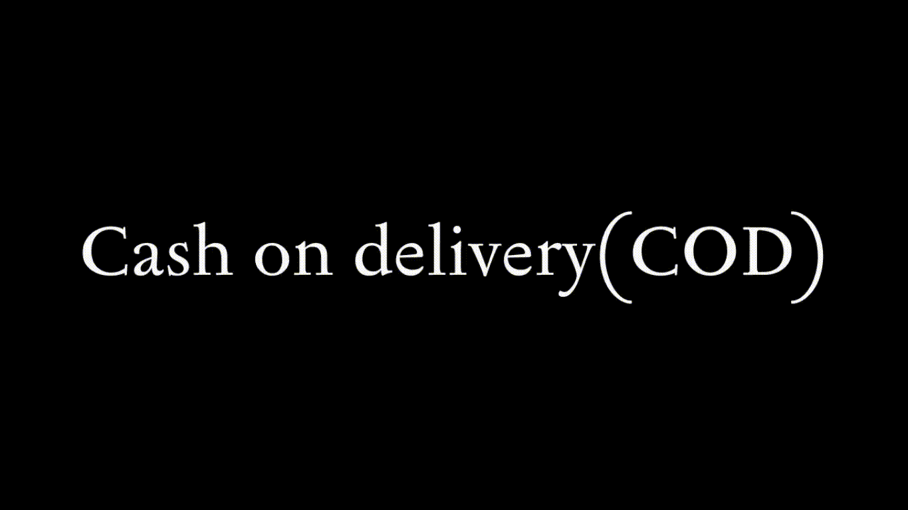

<h1 align="center">
   
</h1>

  <h1>Buennapizza - Order the best pizza on town </h1>

  <a href="#-sobre-a-aplica%C3%A7%C3%A3o"> Sobre </a> &nbsp;&nbsp;&nbsp;| &nbsp;&nbsp;&nbsp;
  <a href="#-tecnologias">Tecnologias</a> &nbsp;&nbsp;&nbsp;|&nbsp;&nbsp;&nbsp;
  <a href="#-conteúdos-aplicados"> Conteúdos aplicados</a> &nbsp;&nbsp;&nbsp;|&nbsp;&nbsp;&nbsp;
  <a href="#-suporte"> Suporte </a> &nbsp;&nbsp;&nbsp;|&nbsp;&nbsp;&nbsp;
  <a href="#-licen%C3%A7a">Licença</a>

  
    
  
  

 

# Buenapizza

Pizza Ordering Website 

Developed with <code>NextJS</code>,<code>Axios</code>,<code>Mongoose</code>, and <code>Redux ToolKit</code>  
 

# About the project

Functionalities:
- Login on the Admin Painel
- Add a new pizza
- Payment using paypal services or `Cash On Delivered` payment method
- Delete pizza from catalog on the Admin Dashboard
- See and change the status order: `preparing` to `on the way` to `delivered`

 

## Little description about the project

   The cool thing about Nextjs is because it's a  full-stack framework(yes! It handles both the frontend and backend of your application) and there are a variety of rendering methods - even mixing and matching those methods as needed.
   On the pizza details page, customer can choose the pizza size, add additional ingredients and the pizza quantity.So...when <code>add to cart</code> button is clicked the navbar cart item is updated, to handle that i could choose some ways to do so, like <code>Prop Drilling</code> as we know, not a good idea, second one was <code>ContextAPI</code> and finally <code>State Management Libraries</code> which was used, to be more precise: Redux Toolkit.
   because <code>STRIPE</code> stripe i already have a project with, for payments <code>PAYPAL</code> service was chosen and  the Cash on delivery option was added as well. Cash on delivery(COD) is a type of transaction where the recipient pays for a good at the time of delivery rather than using credit.
   
   

## :camera: See the app's features:

<h2>Payment with sandbox PayPal account</h2>

<h2>Cash on delivery (COD) payment method</h2>

<h2>Add a new pizza on catalog</h2>

<h2>Admin Dashboard</h2>

 ## Getting started

1. Clone this repo using `git@github.com:eulazzo/buenapizza.git`
2. Move yourself to the appropriate directory: `cd buenapizza` 
3. Run `npm install` to install dependencies 

### Getting started with the backend server

1. Create a `.env` file and add the MongoDB url connection in MONGO_URL field
3. if you dont have yarn installed, type <code> npm install --global yarn </code> on terminal to install it or just use npm instead  
4. Run `yarn run dev` to start the application  

## :rocket: Technologies

<table>
   
  <thead>
    <th>Back-end</th>
    <th>Front-end</th>
  </thead>
   
  <tbody>
    <tr>
      <td>Node.js</td>
      <td>NextJS</td>
    </tr>
    <tr>
      <td></td>
      <td>CSS</td>
    </tr>
    <tr>
      <td>Axios</td>
      <td>Axios</td>
    </tr>
    <tr>
      <td></td>
      <td>React Hooks</td>
    </tr>
  </tbody>
  
</table>

## License

This project is licensed under the MIT License - see the [LICENSE](https://opensource.org/licenses/MIT) page for details.

 

 
 
